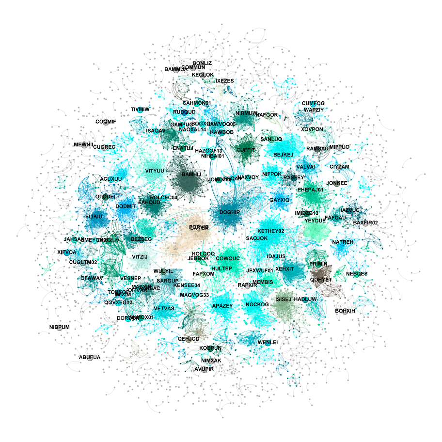
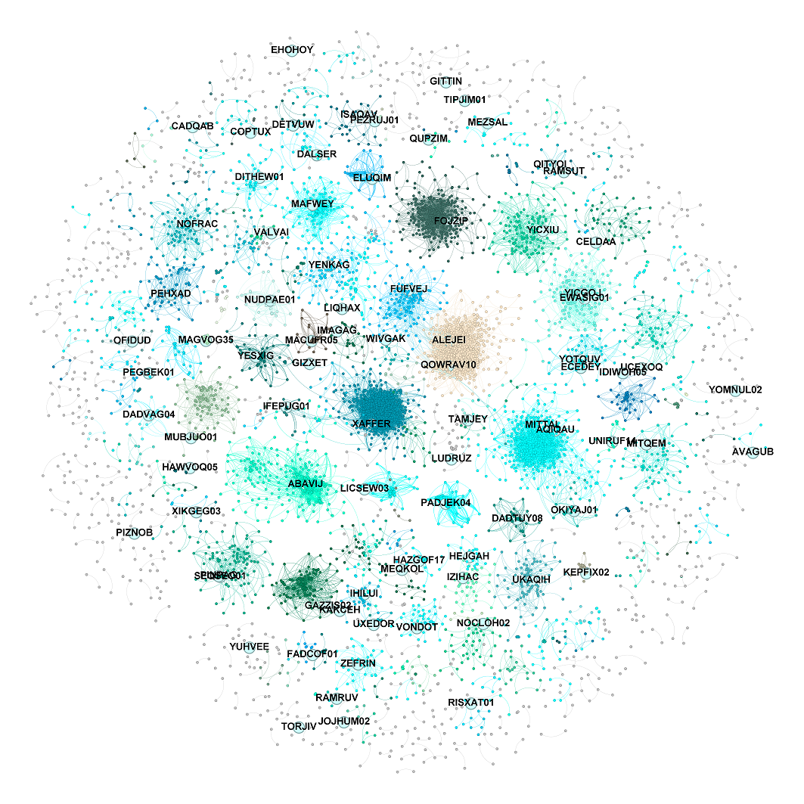

# Inverse Link Prediction in Metal-Organic Frameworks (MOFs) Graphs

  

## Overview
This repository is developed under the guidance of Dr. Mehrdad Jalali and focuses on addressing computational challenges in characterizing Metal-Organic Frameworks (MOFs) using an innovative graph sparsification method. This method, termed Inverse Link Prediction (ILP), leverages Graph Convolutional Networks (GCN) for enhanced analysis.

  
  

  <strong>Original MOFGalaxyNet with 14000 MOFs</strong> &emsp; &emsp; &emsp; <strong>MOFGalaxyNet after applying Inverse Link Prediction Method for Sparsification</strong>

## Concept
This study introduces an innovative method for addressing computational challenges in the characterization of Metal-Organic Frameworks (MOFs) by utilizing graph sparsification through Inverse Link Prediction (ILP) with Graph Convolutional Networks (GCNs). Building upon the MOFGalaxyNet framework, this approach strategically prunes non-critical connections within MOF networks while preserving essential structural properties. The ILP method assesses the significance of each link in the network, enabling the targeted removal of less impactful connections. This reduces network complexity by up to 90% without compromising the accuracy of predictions related to crucial properties, such as gas adsorption capacities. The streamlined, sparsified network retains sufficient information for accurate computational analyses, thereby enhancing the efficiency and manageability of MOF characterization processes, particularly in energy-related applications.

For more details on the creation and implementation of the original MOFGalaxyNet framework, please refer to our dedicated [GitHub repository](https://github.com/MehrdadJalali-KIT/MOFGalaxyNet) where the foundational work on MOFGalaxyNet is documented and available for further exploration.

## Theoretical Background
The foundation of ILP in MOFs is predicated on the differential impact of links within the network. By strategically removing less critical links, we reduce network complexity without undermining the capacity for accurate predictions of crucial properties such as gas adsorption capacities, demonstrated here with metrics like the Pore Limiting Diameter (PLD).

### Jupyter Notebooks and Files

- **requirements.txt**: This file contains all the essential Python packages required to run the notebooks and scripts in this repository.
 
- **CompareMLMethods_Original.ipynb**: This notebook contains the original machine learning methods used in the analysis before any sparsification was applied to the MOF networks.
  
- **CompareMLMethods_Sparcified_0_9.ipynb**: This notebook compares machine learning methods on MOF networks that have been sparsified by Sparcification Threshold 0.9.
  
- **CompareMLMethods_Sparcified_0_95.ipynb**: This notebook compares machine learning methods on MOF networks sparsified by Sparcification Threshold 0.95.
  
- **CompareMLMethods_Sparcified_0_98.ipynb**: This notebook compares machine learning methods on MOF networks sparsified by Sparcification Threshold 0.98.

- **GCN_Sparcification_PredcitUnseen_Final.ipynb**: This notebook focuses on using Graph Convolutional Networks (GCNs) to predict unseen data after the sparsification process, highlighting the robustness of the ILP method.

- **InverseLinkPredcition.ipynb**: This notebook implements the core Inverse Link Prediction algorithm, focusing on the strategic pruning of MOF network links to maintain structural integrity while reducing complexity.

- **Plot_ILP.ipynb**: This notebook generates plots and visualizations related to the Inverse Link Prediction method, aiding in the presentation of results.

- **Sparcification_GCN_Heatmap.ipynb**: This notebook generates heatmaps to visualize the performance of GCN models under different sparcification scenarios.

- **Sparcification_Plots.ipynb**: Dedicated to generating plots and visualizations related to sparcification, illustrating the results of different techniques applied in the study.

- **Data/**: Directory containing datasets representing MOF structures and their respective properties.

- **Dataset_Sparcified/**: Directory containing sparsified datasets for use in various analyses.

- **ExtraCodes/**: Directory containing additional scripts and code snippets used throughout the project.
  
- **GraphAnalysis/**: Directory containing scripts and outputs related to the analysis of graph structures in MOF networks.
  

## Evaluation
The effectiveness of our sparsification method is assessed through metrics such as network parameter centralities and machine learning predictions. Our method has proven highly effective in predicting essential MOF properties, enhancing both theoretical understanding and practical applications in material science.

## How to Use
To utilize the scripts, please ensure your environment is prepared with the required Python version and libraries as listed in `requirements.txt`. Detailed setup instructions can be found in the installation guide.

## Contribution
We welcome contributions to enhance and expand this project. Please feel free to fork the repository, submit pull requests, or open issues to propose changes or discuss enhancements.

## Citation
If you use our MOFGalaxyNet, or ILP Strategy, or any part of this repository in your work, please cite the following paper:
Jalali, Mehrdad, AD Dinga Wonanke, and Christof Wöll. "MOFGalaxyNet: a social network analysis for predicting guest accessibility in metal–organic frameworks utilizing graph convolutional networks." Journal of Cheminformatics 15.1 (2023): 94. [https://doi.org/10.1186/s13321-023-00764-2](https://doi.org/10.1186/s13321-023-00764-2)
